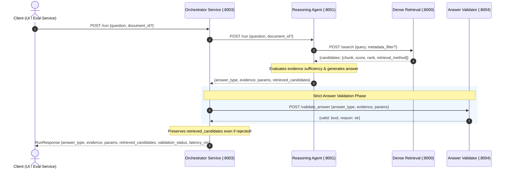

# Project Update: Retrieved Candidates Integration & Failure Analysis

**Date:** September 2026  
**Components Affected:** Orchestrator Service, Reasoning Service, Dense Retrieval Integration  
**Focus Area:** Traceability, Failure Analysis, and Downstream Evaluation Alignment  

---

## 1. Executive Summary

This project update introduces end-to-end support for **retrieved candidate traceability** in Project LEDGER. The Orchestrator's `/run` response now includes `retrieved_candidates` alongside the strict answer schema (`answer_type`, `evidence`, `params`) and validation metadata.

### Why This Change Was Made
1. **Accurate Failure Analysis:** When the reasoning agent produces an answer that is rejected by the validator (e.g. missing evidence citations, incorrect calculation formula) or returns `insufficient_evidence`, failure diagnosis requires knowing *which exact text and table chunks were retrieved*.
2. **True Reasoning Reflection:** The returned candidates reflect the exact search queries, sub-queries, and retries executed by the reasoning agent's LangGraph pipeline—rather than a detached, synthetic search query generated by the orchestrator.
3. **Automated Evaluation Support:** Enables `eval-service` to compute retrieval metrics (such as **Recall@K**, **MRR**, and page-level attribution) directly from `/run` responses via `extract_retrieved_pages`.
4. **Validation Isolation:** Preserves the project's strict validation boundary: `validator-service` validates only the core answer fields (`answer_type`, `evidence`, `params`), while `retrieved_candidates` is surfaced cleanly in the orchestrator's HTTP output.

---

## 2. Architecture & Data Flow



---

## 3. Detailed Component Changes

### A. Orchestrator Service (`services/orchestrator`)

#### 1. Schema Extensions ([`schemas.py`](services/orchestrator/schemas.py))
- **`RetrievedCandidate` Schema Added:**
  ```python
  class RetrievedCandidate(BaseModel):
      document_id: str
      page: Union[int, List[int], str]
      section: Optional[str] = "General"
      content_type: Optional[str] = "text"
      text: Optional[str] = None
      score: Optional[float] = None
      rank: Optional[int] = None
      retrieval_method: Optional[str] = None
      scores: Optional[Dict[str, float]] = None
      metadata: Optional[Dict[str, Any]] = None
      chunk: Optional[Dict[str, Any]] = None
  ```
- **`RunResponse` Extended:** Added `retrieved_candidates: List[Dict[str, Any]] = Field(default_factory=list)`.
- **`QueryAuditItem` Extended:** Added `candidates_count: int = 0` to persist candidate volumes in the dashboard audit log.

#### 2. Query Execution & Safety Handling ([`main.py`](services/orchestrator/main.py))
- **Candidate Extraction:** Extracts `retrieved_candidates` from the reasoning response.
- **Strict Validation Boundary:** Prepares `validation_payload` containing **only** `answer_type`, `evidence`, and `params`. Downstream validator requirements remain strictly enforced.
- **Failure Analysis Preservation:** If the validator rejects an answer:
  - The answer fields fall back to `insufficient_evidence` with the validator's rejection explanation.
  - `retrieved_candidates` are **retained** in `RunResponse`, allowing engineers and automated evals to see what chunks caused or failed to prevent the rejection.
- **Resilient Fallback:** If the reasoning service is unreachable or times out, `retrieved_candidates` safely defaults to an empty list (`[]`).

#### 3. Downstream Client Forwarding ([`clients.py`](services/orchestrator/clients.py))
- Updated `run_reasoning` to forward optional `document_id` scoping in the payload to the reasoning microservice.

#### 4. Metadata Catalog Updates ([`metadata_store.py`](services/orchestrator/metadata_store.py))
- Updated `record_query` to track `candidates_count` alongside `evidence_count` and latency.

---

### B. Reasoning Service (`services/reasoning`)

#### 1. Schema Extensions ([`schemas.py`](services/reasoning/schemas.py))
- Extended `RetrievedChunk` to optionally preserve retrieval ranking and scoring metrics:
  ```python
  class RetrievedChunk(BaseModel):
      document_id: str
      page: List[int]
      section: Optional[str] = "General"
      content_type: str
      text: str
      chunk_id: Optional[str] = None
      score: Optional[float] = None
      rank: Optional[int] = None
      retrieval_method: Optional[str] = None
      scores: Optional[Dict[str, float]] = None
  ```

#### 2. Search & Candidate Adaptation ([`tools.py`](services/reasoning/tools.py))
- Enhanced `_adapt_raw_chunk(raw, candidate_meta)` to map `score`, `rank`, `retrieval_method`, and `scores` from the raw retrieval candidate.
- Updated `search_documents` to forward `metadata_filter: {"document_id": document_id}` to `/search` when `document_id` is supplied, and to enforce document scoping on candidate chunks.

#### 3. State & Graph Orchestration ([`state.py`](services/reasoning/state.py) & [`retriever.py`](services/reasoning/retriever.py))
- Added `document_id: Optional[str]` to `AgentState`.
- Updated `retrieve_evidence` to forward `document_id` into `_run_search`.

#### 4. Microservice API & Response Formatting ([`main.py`](services/reasoning/main.py))
- `RunRequest` now accepts `document_id: Optional[str] = None`.
- `RunResponse` now includes `retrieved_candidates: List[Dict[str, Any]] = []`.
- `run_agent_graph` extracts all `retrieved_chunks` from the LangGraph `result_state`, deduplicates them, constructs nested `chunk` objects for team schema uniformity, and attaches `retrieved_candidates` to the output payload.

---

### C. Dense Retrieval Integration (`services/dense-retrieval`)

- The retrieval API contract (`POST /search`) already returns `RetrievalResponse(candidates: list[Candidate])` with intermediate fusion scores (`scores`), `rank`, and `retrieval_method`.
- With the reasoning service now capturing these fields, candidate ranks and similarity scores flow through to the orchestrator response without loss of fidelity.

---

## 4. API Payload Comparison

### Previous `/run` Response
```json
{
  "answer_type": "direct",
  "evidence": [
    {
      "document_id": "cts-corporation_2019.pdf",
      "page": [1],
      "section": "Financial Statements"
    }
  ],
  "params": {
    "value": 469850
  },
  "validation_status": "valid",
  "validation_reason": null,
  "latency_ms": 1420.5
}
```

### Updated `/run` Response
```json
{
  "answer_type": "direct",
  "evidence": [
    {
      "document_id": "cts-corporation_2019.pdf",
      "page": [1],
      "section": "Financial Statements"
    }
  ],
  "params": {
    "value": 469850
  },
  "retrieved_candidates": [
    {
      "document_id": "cts-corporation_2019.pdf",
      "page": [1],
      "section": "Financial Statements",
      "content_type": "table",
      "text": "Net sales: 469850. Operating earnings: 38750.",
      "chunk_id": "cts_2019_chunk_004",
      "score": 0.942,
      "rank": 1,
      "retrieval_method": "hybrid",
      "scores": {
        "dense": 0.88,
        "bm25": 16.4,
        "rrf": 0.032
      },
      "chunk": {
        "chunk_id": "cts_2019_chunk_004",
        "document_id": "cts-corporation_2019.pdf",
        "page": [1],
        "section": "Financial Statements",
        "content_type": "table",
        "text": "Net sales: 469850. Operating earnings: 38750."
      }
    }
  ],
  "validation_status": "valid",
  "validation_reason": null,
  "latency_ms": 1420.5
}
```

---

## 5. Downstream Compatibility & Verification

| Service | Impact | Compatibility Status |
| :--- | :--- | :--- |
| **`validator-service`** | Validates only `answer_type`, `evidence`, and `params`. | **100% Compatible:** Orchestrator strips `retrieved_candidates` from validation payload. |
| **`eval-service`** | Extracts `(document_id, page)` using `extract_retrieved_pages`. | **100% Compatible:** Matches top-level `response["retrieved_candidates"]` keys. Verified via automated test. |
| **`ui` (Gradio Chat)** | Formats answer badge, params, and source citations. | **100% Compatible:** Ignores unparsed keys; UI operates without disruption. |

### Verification Suite
- **Orchestrator Test Suite (`pytest`):** 8/8 tests passing (`test_orchestrator.py`).
- **Failure Analysis Test:** Verified candidate retention during validation rejection.
- **Eval Extraction Test:** Verified `extract_retrieved_pages(resp)` returns expected `[(doc_id, page)]` tuples.
